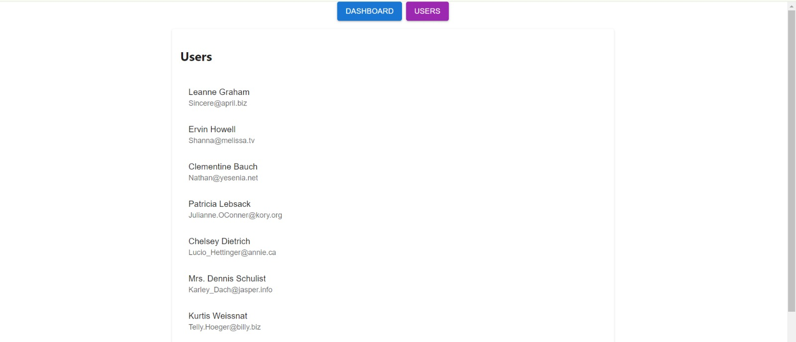
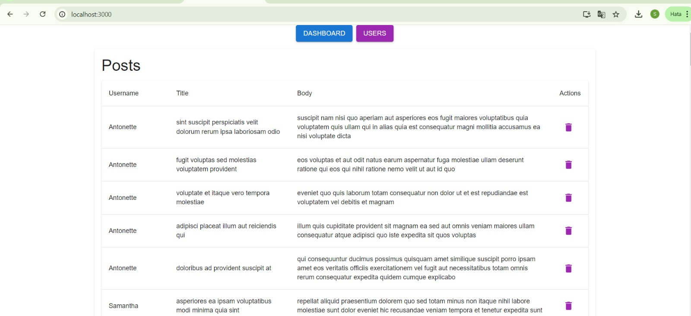

# PHP & React Dashboard Uygulaması

Bu proje, PHP ve Slim Framework kullanılarak geliştirilen bir API ve React kullanılarak hazırlanan bir yönetim panelini içermektedir. API, kullanıcı ve gönderi bilgilerini yönetmek için kullanılırken, React tarafı bu verileri görselleştirmek ve kullanıcıya kolay bir yönetim arayüzü sunmak için kullanılır.

## Proje Yapısı

- **Backend**: PHP, Slim Framework, Eloquent ORM
- **Frontend**: React, Material-UI
- **Veritabanı**: MySQL (Eloquent ORM ile yönetiliyor)

## Özellikler

- Kullanıcıların ve gönderilerin listelenmesi.
- Gönderilerin silinmesi.
- Basit ve kullanıcı dostu arayüz.
- RESTful API ile iletişim.
- CORS desteği ile frontend ve backend iletişimi.

## Kurulum

### Gereksinimler

- PHP 8.x ve üzeri
- Composer
- Node.js ve npm
- MySQL

### Backend Kurulumu

1. Depoyu klonlayın:
   ```bash
   git clone https://github.com/fathkoc/php_React.git
   cd proje-adi
   ```

2. Gerekli PHP paketlerini yükleyin:
   ```bash
   composer install
   ```

3. Veritabanı ayarlarını `app/settings.php` dosyasından düzenleyin.

4. Veritabanı tablolarını oluşturun:
   ```bash
   php migrate.php
   ```

## JSONPlaceholder API'den Veri Çekme
    Proje, JSONPlaceholder API'sinden `users` ve `posts` verilerini çekmek ve bunları veritabanına kaydetmek için bir PHP betiği içerir. Bu betik, `users` ve `posts` tablolarına verileri çeker ve veritabanına ekler.

    Veri Çekme Betiğini Çalıştırma: Aşağıdaki komutla betiği çalıştırarak verileri çekin:
    ```bash
    php fetch-data.php

5. PHP sunucusunu başlatın:
   ```bash
   php -S localhost:8000 -t public
   ```

### Frontend Kurulumu

1. React uygulamasına geçiş yapın:
   ```bash
   cd react-app
   ```

2. Gerekli npm paketlerini yükleyin:
   ```bash
   npm install
   ```

3. React uygulamasını başlatın:
   ```bash
   npm start
   ```

## Kullanım

- **Dashboard**: Gönderilerin ve kullanıcıların yönetimi için ana panel.
- **Users**: Kullanıcıların listelendiği ekran.
- **Posts**: Kullanıcıların gönderilerinin listelendiği ve silinebildiği ekran.

## Proje Görselleri

Aşağıda proje ekranlarından bazı görüntüler bulunmaktadır:

### Dashboard


### Kullanıcılar


## API Endpointleri

### Kullanıcılar

- `GET /users`: Tüm kullanıcıları getirir.
- `GET /users/{id}`: Belirli bir kullanıcıyı getirir.

### Gönderiler

- `GET /posts`: Tüm gönderileri getirir.
- `GET /posts/{id}`: Belirli bir gönderiyi getirir.
- `DELETE /posts/{id}`: Belirli bir gönderiyi siler.


